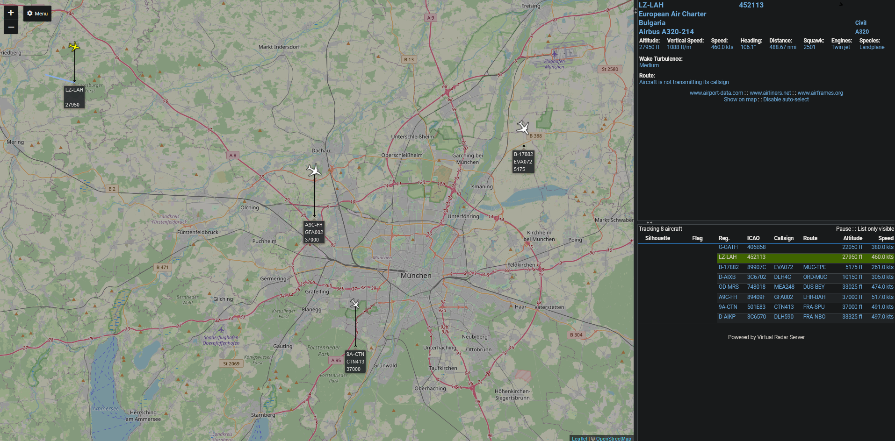

# Virtual-Radar-Service

quick start repo, software by https://github.com/vradarserver/vrs

## to work on pi24-bookworm image by FlightRadar24
Yes, i know that you now have the premium version of FR24 for free, but it's still fun to see what your own little antenna receives.

## adds stuff i like to .bashrc
default credentials:
    
    ssh pi@pi24-bookworm
    pw: raspberry

run:

    echo "
    alias ll='ls -alF'
    alias live='watch -n 1 fr24feed-status'
    echo fr24feed-status
    fr24feed-status
    " >> ~/.bashrc
    source ~/.bashrc

# Installing Virtual Radar Service:
Make sure that `fr24feed` is configured to output the BaseStation data `bs`. Before changing the .ini file, stop the fr24feed service.

    sudo systemctl stop fr24feed
Edit the `fr24feed.ini` file: 
    
    sudo nano /etc/fr24feed.ini
It should look like this:

    receiver="dvbt"
    fr24key="YOURKEYHERE"
    path="/usr/lib/fr24/dump1090"
    bs="yes"
    raw="no"
    mlat="yes"
    mlat-without-gps="yes"
Restart `fr24feed`:

    sudo systemctl restart fr24feed

Clone this repo:

    git clone https://github.com/karlscholz/virtual-radar-service.git
    cd virtual-radar-service

Extract the tarballs:

    tar xvf VirtualRadar.tar.gz
    tar xvf VirtualRadar.LanguagePack.tar.gz
    tar xvf VirtualRadar.WebAdminPlugin.tar.gz
(downloaded from "virtualradarserver.co.uk/Files/\<filename\>.tar.gz")

Install `Mono` to run windows executables on Debian:

    sudo apt update
    sudo apt install mono-complete

Run once manually (sets up username and password)

    mono VirtualRadar.exe -nogui -createAdmin:user -password:passwd

Open a Webbrowser and check via the first link if the service is up. Then log into the Admin Panel via the second link and check if it automatically found the receiver by `fr24feed` on `127.0.0.1:30003`.
- http://pi24-bookworm:8080/VirtualRadar
- http://pi24-bookworm:8080/VirtualRadar/WebAdmin/Index.html
 
> **_Troubleshooting:_**
> Check with e.g. netcat, that `fr24feed` actually provides data:

    nc localhost 30003

> **_Troubleshooting:_**
> Make sure that the `VirtualRadar.exe.config` file is present and contains:

    <?xml version="1.0"?>
    <configuration>
        <configSections>
        </configSections>
        <startup>
            <supportedRuntime version="v2.0.50727"/>
        </startup>
        <runtime>
            <assemblyBinding  xmlns="urn:schemas-microsoft-com:asm.v1">
                <dependentAssembly>
                    <assemblyIdentity name="Mono.Data.Sqlite"
                                    publicKeyToken="0738eb9f132ed756"
                                    culture="neutral" />
                    <bindingRedirect oldVersion="2.0.0.0"
                                    newVersion="4.0.0.0" />
                </dependentAssembly>
            </assemblyBinding>
        </runtime>
    </configuration>

Lastly, add a service, so you don't have to manually start the virtual radar everytime.

Create a Systemd Service File:

    sudo nano /etc/systemd/system/virtualradar.service
and paste:

    [Unit]
    Description=Virtual Radar Server
    After=network.target

    [Service]
    ExecStart=/usr/bin/mono /home/pi/vrs/VirtualRadar.exe -nogui
    Restart=always
    User=pi
    Group=pi
    Environment=MONO_ENV_OPTIONS=--server --gc=sgen

    [Install]
    WantedBy=multi-user.target
Reload Systemd Daemon:

    sudo systemctl daemon-reload

Enable the Service:

    sudo systemctl enable virtualradar.service

Start the Service:

    sudo systemctl start virtualradar.service

Finally validate all by:

    sudo reboot now